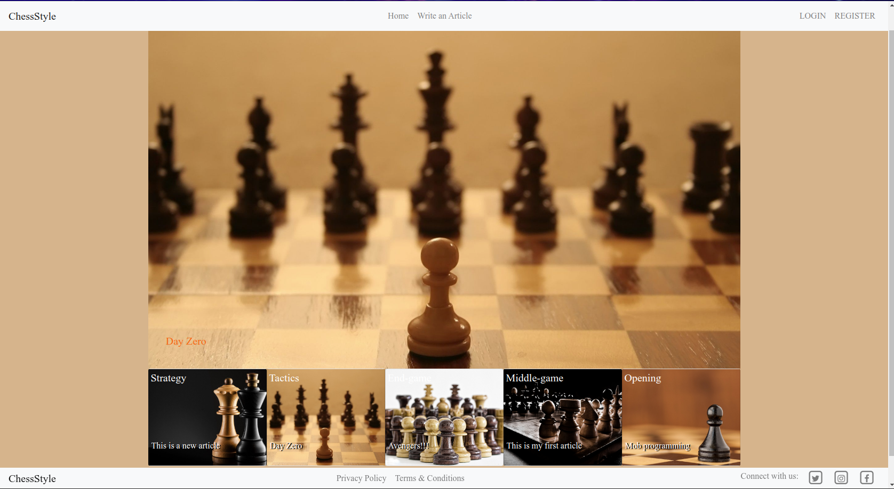

# ChessStyle

> ChessStyle is a blogging application where users can create amazing articles about chess.

Additional description about the project and its features.

## Built With

- Ruby,
- Ruby on Rails, Bootstrap

## Live Demo

[Live Demo Link](https://fierce-meadow-82426.herokuapp.com/)

- Login as 'Admin' to view admin priviledges

## Getting Started

To get a local copy up and running follow these simple example steps.
- git clone git@github.com:trekab/chess-style.git

Then you browse to the folder and exucute the following commands
- cd chess-style
- bundle install

Then run the migrations
- rails db:migrate

And finally setup sample data for the app
- rails db:setup

Now, you can open the app in your text editor to check out the source code and run 'rails s' in the terminal to test the app locally.

## Authors

👤 **Treasure Kabareebe**

- Github: [@trekab](https://github.com/trekab)
- Twitter: [@TKabareebe](https://twitter.com/TKabareebe)
- Linkedin: [Treasure Kabareebe](https://www.linkedin.com/in/treasure-kabareebe/)

## 🤝 Contributing

Contributions, issues and feature requests are welcome!

Feel free to check the [issues page](issues/).

## Show your support

Give a ⭐️ if you like this project!

## Acknowledgments

- [Design idea](https://www.behance.net/gallery/14554909/liFEsTlye-Mobile-version) by [Nelson Sakwa on Behance](https://www.behance.net/sakwadesignstudio)

## 📝 License

This project is [MIT](lic.url) licensed.

